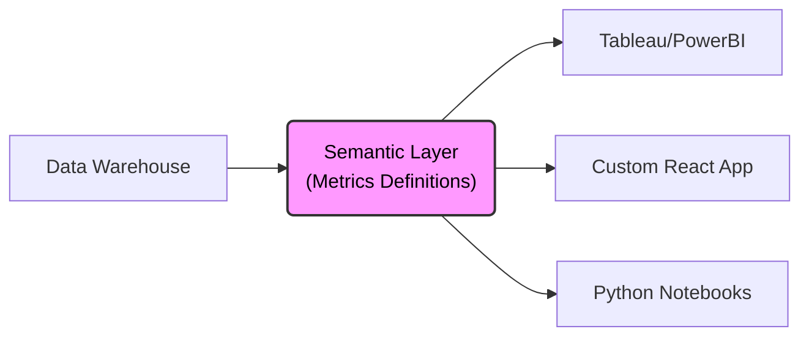

# 🛡️ Headless BI: Semantic Layer

  

> **O Problema:** A "anarquia das métricas". O Dashboard do Marketing diz que o Churn é 5%, o Excel do Financeiro diz 7%. A lógica de negócios está espalhada, duplicada e não confiável.
> 
> **A Solução:** Uma **Camada Semântica Headless**. Definimos a regra de negócio *uma vez* em código (YAML), versionamos com Git e servimos via API para qualquer ferramenta (Tableau, PowerBI, React App).

## 🏗️ Arquitetura

Este doc demonstra uma arquitetura onde o BI é tratado como código (*Configuration as Code*), desacoplando a definição da métrica da ferramenta de visualização.



## 🚀 Como funciona

A lógica não vive em queries SQL ad-hoc ou arquivos `.pbix` fechados (caixas pretas). Ela vive em `schema/metrics.yml`.

1. **Definição Única:** A métrica `net_revenue` é calculada subtraindo impostos e reembolsos diretamente no modelo de dados central.
2. **Consumo via API:** Ferramentas externas consultam a métrica sem precisar saber a fórmula SQL subjacente.
   
   ```bash
   # Exemplo de chamada à API Semântica
   curl -X GET "http://localhost:4000/api/v1/load?query={measures:['orders.net_revenue']}"
   ```

3. **Consistência:** Se a regra fiscal mudar, atualizamos apenas o arquivo YAML, e todos os dashboards refletem a mudança instantaneamente.

## 🛠️ Instalação e Execução

Pré-requisitos: Docker e Docker Compose.

```bash
# 1. Clone o repositório
git clone [https://github.com/seu-usuario/headless-bi-semantic-layer-poc.git](https://github.com/seu-usuario/headless-bi-semantic-layer-poc.git)

# 2. Acesse a pasta do projeto
cd headless-bi-semantic-layer-poc

# 3. Suba a stack (Banco de Dados Mock + API Semântica)
docker-compose up -d

# 4. Verifique se a API está pronta para receber requisições
curl http://localhost:4000/readyz
```

## 📂 Estrutura do Projeto

A organização segue os padrões de Engenharia de Analytics moderna:

* `schema/`: Onde residem as definições de métricas (A "Single Source of Truth").
    * `metrics.yml`: Definições globais de KPIs (Churn, MRR, Revenue).
    * `orders.yml`: Mapeamento da tabela de fatos bruta.
* `dashboard-templates/`: Exemplos de conectores para ferramentas de BI (Tableau/PowerBI).
* `docker-compose.yml`: Orquestração do ambiente local e serviços dependentes.

## 🤝 Contribuindo

PRs são bem-vindos. Por favor, siga o padrão de *Conventional Commits* (ex: `feat: add churn metric`) e garanta que novas métricas incluam o campo `description` para alimentar automaticamente o Catálogo de Dados.

---
[LinkedIn](https://) | [Artigo no Medium explicando esta arquitetura](http://)
